# barbuttons-mod

Mod of [BarButtons](https://jaxeadv.com/barbuttons) targeting an **ESP32-C3 Zero** microcontroller.
Two types of changes are covered: firmware and physical casing.

---

## Firmware (`barbuttons_keymap.ino`)

### Overview

Based on the original BarButtons v1 firmware, this version replaces the STA-based OTA workflow with a **self-hosted WiFi Access Point** and a **browser-based configuration interface**.

### Features

| Feature | Description |
|---|---|
| **AP config mode** | Starts a WiFi AP (`BarButtons-Config` / `barbuttons`) on demand |
| **Web keymap editor** | Browser UI at `http://192.168.4.1` to configure short and long press actions for all 8 buttons |
| **Multiple keymaps** | Three independent keymap slots switchable on-device via Button 4 combos; active slot persisted across reboots |
| **NVS persistence** | All settings (keymaps, active slot, BLE name) stored in flash via the `Preferences` library; survive reboots and firmware updates |
| **OTA firmware update** | Upload a compiled `.bin` directly from the browser; device reboots automatically |
| **NimBLE BLE keyboard** | HID keyboard over BLE with secure bonding (Secure Connections, Just Works); CCCD state persisted per peer |
| **LED status indicator** | Blink pattern varies by state — see table below |

### LED blink patterns

| State | ON duration | OFF duration |
|---|---|---|
| BT disconnected | 500 ms | 500 ms |
| Config mode | 100 ms | 3000 ms |
| BT connected | LED off (flashes briefly on keypress) | — |

### Entering / exiting config mode

1. **Hold Button 4 for ~5 seconds** (LED starts flashing rapidly).
2. Connect to WiFi SSID **`BarButtons-Config`**, password **`barbuttons`**.
3. Open **`http://192.168.4.1`** in a browser.
4. **Keymap tab** — set Short Press / Long Press action per button for any of the three keymap slots, then click **Save & Reboot**.
5. **Firmware tab** — choose a `.bin` and click **Flash Firmware** for OTA update.
6. **BLE Bonds tab** — click **Clear BLE Bonds & Reboot** if the device no longer auto-connects.
7. To exit config mode **without** any changes, tap Button 4 on the device.

> **Note:** Button 4 long-press is reserved as the config trigger and cannot be remapped.

### Multiple keymaps

The firmware supports three independent keymap slots.  Each slot has its own Short Press and Long Press assignment for all 8 buttons.  All three slots are edited together in the web config UI and are saved to flash at the same time.

**Switching keymaps on-device (no config mode required):**

| Combo | Action |
|---|---|
| Hold Button 4, then press Button 1 | Switch to Keymap 1 |
| Hold Button 4, then press Button 2 | Switch to Keymap 2 |
| Hold Button 4, then press Button 3 | Switch to Keymap 3 |

After switching, the LED flashes **1, 2, or 3 times** to confirm which keymap is now active.  The selection is saved to flash immediately and survives reboots.

### Application state diagram

```mermaid
stateDiagram-v2
    [*] --> BT_Disconnected : power on / boot

    BT_Disconnected : BT Disconnected\n(LED slow blink 500/500 ms)
    BT_Connected    : BT Connected\n(LED off; brief flash on keypress)
    Config_Mode     : Config Mode\n(WiFi AP active, LED fast blink 100/3000 ms)

    BT_Disconnected --> BT_Connected    : host connects via BLE
    BT_Connected    --> BT_Disconnected : host disconnects

    BT_Disconnected --> Config_Mode     : Button 4 held ≥ 5 s
    BT_Connected    --> Config_Mode     : Button 4 held ≥ 5 s

    Config_Mode --> BT_Disconnected : tap Button 4 (exit without save)\nor Save & Reboot web action\nor Clear Bonds & Reboot web action\nor Flash Firmware OTA web action
```

> **Key behaviours by state**
>
> | State | Short press (btns 1–3, 5–8) | Long press (btns 1–3, 5–8) | Button 4 short press | Button 4 long press | Combo 4+1/4+2/4+3 |
> |---|---|---|---|---|---|
> | **BT Disconnected** | Sends BLE key (silently dropped if host not yet connected) | Sends BLE key (if mapped; silently dropped if not connected) | `c` key | Enter config mode | Switch keymap |
> | **BT Connected** | Sends BLE key | Sends BLE key (if mapped) | `c` key | Enter config mode | Switch keymap |
> | **Config Mode** | No BLE action | No BLE action | Exit config mode | — (not processed) | — (not processed) |

### Button keymap defaults (Keymap 1)

| Button | Short press | Long press |
|---|---|---|
| 1 | `+` | repeat `+` |
| 2 | `-` | repeat `-` |
| 3 | `n` | `d` |
| 4 | `c`/exit config mode | enter config mode |
| 5 | Up Arrow | repeat Up Arrow |
| 6 | Left Arrow | repeat Left Arrow |
| 7 | Right Arrow | repeat Right Arrow |
| 8 | Down Arrow | repeat Down Arrow |

Long press set to **"Repeat short key"** (value `0`) means the short key auto-repeats while the button is held.
Any other key code sends that key exactly once on long press.

### Pin assignments (ESP32-C3 Zero)

| Signal | GPIO |
|---|---|
| LED | 6 |
| Row 0 | 2 |
| Row 1 | 1 |
| Row 2 | 0 |
| Col 0 | 3 |
| Col 1 | 4 |
| Col 2 | 5 |

### Required libraries

- [Keypad](https://github.com/Chris--A/Keypad)
- [NimBLE-Arduino](https://github.com/h2zero/NimBLE-Arduino)
- `WiFi`, `WebServer`, `Update`, `Preferences` — bundled with the Arduino ESP32 core

### Build & flash

1. Install the **ESP32** board package in Arduino IDE (target board: `ESP32C3 Dev Module` or the equivalent Zero variant).
2. Set **Tools → Partition Scheme** to:
   > **Minimal SPIFFS (1.9 MB APP with OTA / 190 KB SPIFFS)**

   This is required because the sketch exceeds the default 1.28 MB app partition.
3. Set `const int DEBUG = 0;` before a production flash (saves flash and avoids waiting for USB-CDC on boot).
4. Compile and upload via USB.

---

## Hardware / Casing modifications

The 3-D printed casing was modified from the original BarButtons design as follows:

- **M5 bolts** used instead of the original M4 bolts for the main assembly.
- **Heat-set inserts for M3 bolts** replacing the plain holes for the smaller fasteners.
- **Wemos D1 Mini pocket removed**; the cavity is resized to fit an **ESP32-C3 Zero** (smaller footprint).
- **LED aperture changed to a 5 mm round hole, 5 mm deep**, so the dome of a standard 5 mm LED just barely protrudes at the surface. The original design used a much larger waterproof LED bezel; here the LED is simply pressed into the hole and sealed with RTV silicone.
