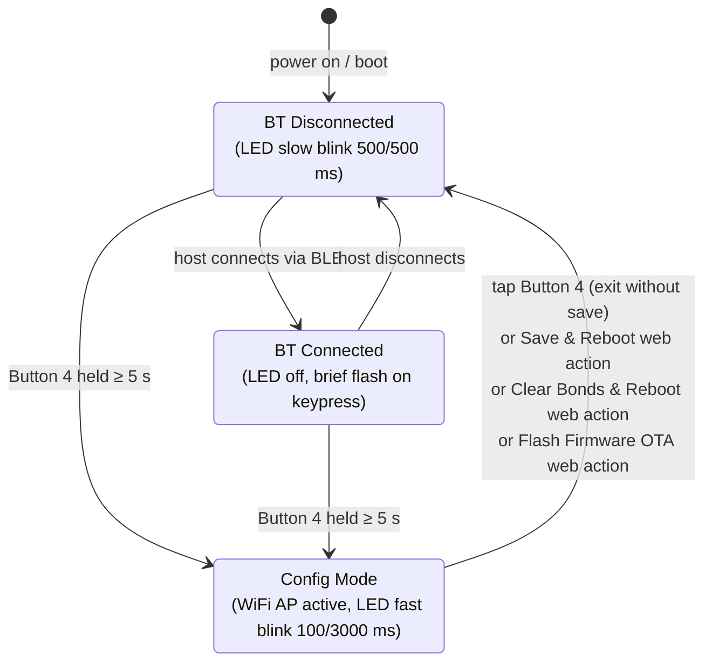

# Description

Remote Bluetooth (BLE) buttons targeting an **ESP32-C3 Zero** microcontroller acting as HID device and/or BTHome device

---

## Firmware

### Overview

Based on the original [BarButtons](https://jaxeadv.com/barbuttons) v1 firmware, this version replaces the STA-based OTA workflow with a **self-hosted WiFi Access Point** and a **browser-based configuration interface**.

### Features

| Feature | Description |
|---|---|
| **AP config mode** | Starts a WiFi AP (`RemoteButtons-Config` / `remotebuttons`) on demand |
| **Web keymap editor** | Configure Short Press and Long Press action (key + BLE target) for all 8 buttons across 3 keymap slots |
| **Per-key BLE target** | Each button press can target: *use target selector*, *broadcast to all HID peers*, *a specific bonded HID peer*, or *BT Home advertisement* |
| **Multiple keymaps** | Three independent keymap slots switchable on-device via Button 4 combos; active slot persisted across reboots |
| **NVS persistence** | All settings (keymaps, active slot, BLE name, battery/power flags) stored in ESP-IDF NVS flash; survive reboots and OTA updates |
| **OTA firmware update** | Upload a compiled `.bin` directly from the browser; device reboots automatically |
| **NimBLE BLE keyboard** | HID keyboard over BLE with secure bonding (Secure Connections, Just Works); CCCD state persisted per peer |
| **BTHome support** | Send button presses to your Home Assistant 
| **Multi-connection** | Up to 3 simultaneous BLE HID connections; cycle active target or broadcast to all with button combos |
| **LED status indicator** | Blink pattern varies by state — see table below |
| **Battery measurement** | Reads cell voltage via voltage divider (680 kΩ : 220 kΩ), reports percentage over BLE, and displays current voltage & percentage in the web config UI |
| **BLE power saving** | Optional negotiation of low-power connection parameters to reduce idle current draw |
| **Light sleep** | FreeRTOS tickless idle light sleep; drops CPU current from ~30 mA to a few µA when idle (BLE event window widened to 50–100 ms to allow idle time) |

### LED blink patterns

| State | ON duration | OFF duration |
|---|---|---|
| BT disconnected | 500 ms | 500 ms |
| Config mode | 100 ms | 3000 ms |
| BT connected | LED off (brief flash on keypress) | — |

### Entering / exiting config mode

1. **Hold Button 4 for ~5 seconds** — LED switches to rapid config-mode blink.
2. Connect to WiFi SSID **`RemoteButtons-Config`**, password **`remotebuttons`**.
3. Open **`http://192.168.4.1`** in a browser (works on mobile).
4. **Keymap Configuration** — set Short Press / Long Press action and BLE target per button for any of the three keymap slots, then click **Save & Reboot**.
5. **Firmware Update** — choose a `.bin` and click **Flash Firmware** for OTA update.
6. **BLE Bonds** — click **Clear BLE Bonds & Reboot** if the device no longer auto-connects.
7. **Device Settings** — change the BLE device name, enable/disable battery reading and BLE power saving, set max connections.
8. To exit config mode **without** saving any changes, tap Button 4 on the device.

> **Note:** Button 4 long-press is reserved as the config trigger and cannot be remapped.

> **Battery info:** when battery reading is enabled, the config page shows the current battery voltage (mV) and charge percentage measured at the moment config mode was entered.

### Web config UI

The config interface is a single-file HTML page served directly from flash. It is:

- **Mobile-first** — card-based layout, large tap targets, works comfortably on a phone or tablet.
- **Per-button cards** — each of the 8 buttons has its own expandable card showing Short Press and Long Press settings side-by-side on wider screens, stacked on mobile.
- **All settings in one page** — keymap editor, device settings (BLE name, battery, power saving, max connections), firmware OTA, bond management.

### Multiple keymaps

The firmware supports three independent keymap slots.  Each slot has its own Short Press and Long Press assignment for all 8 buttons.  All three slots are edited together in the web config UI and are saved to flash at the same time.

**Switching keymaps on-device (no config mode required):**

| Combo | Action |
|---|---|
| Hold Button 4, then press Button 1 | Switch to Keymap 1 |
| Hold Button 4, then press Button 2 | Switch to Keymap 2 |
| Hold Button 4, then press Button 3 | Switch to Keymap 3 |

After switching, the LED flashes **1, 2, or 3 times** to confirm which keymap is now active.  The selection is saved to flash immediately and survives reboots.

### Multi-connection

It's possible to connect multiple devices and send keystrokes to all of them (default) or to a specific target.

To save power BLE advertisements are only sent for 60 seconds after the first device is connected, if the second device has not connected in that time then it will never connect. When no devices are connected it will advertise indefintely and will restart advertisements when a device is connected, so turning the keyboard off and on while both devices are in range should connect.

Targets are automatically reconnected by the saved bonds, however only 1 direct advertisement is allowed at the same time and it defaults to undirected advertisements after a timeout, that means if device 2 is ready to connect but device 1 is not and the direct advertisements is directed towards device 1, device 2 will be able to see the undirected advertisements but will not automatically reconnect. This is a limitation of the BLE stack. So pair the device you use the most first, that way it connects to device 1 and will then attempt direct advertisements for device 2, which when in range will also automatically connect.

Targets are sorted on their MAC address so if 2 devices are connected, this first device in the cycle will always be the same regardless of order of connection.

** Switching target device **

| Combo | Action |
|---|---|
| Hold Button 4, then press Button 5 | Cycle between individual connected targets (LED blink count = slot index, long blink is broadcat to all) |

Each button mapping can also have its own fixed target (set in the web config UI), overriding the runtime target selector for that specific key.

### Application state diagram

### Button keymap defaults

These factory defaults apply to **all three keymap slots** on a fresh device (i.e. when no saved keymap exists in flash).

| Button | Short press | Long press |
|---|---|---|
| 1 | `+` | repeat `+` |
| 2 | `-` | repeat `-` |
| 3 | `n` | `d` |
| 4 | `c`/exit config mode | enter config mode |
| 5 | Up Arrow | repeat Up Arrow |
| 6 | Left Arrow | repeat Left Arrow |
| 7 | Right Arrow | repeat Right Arrow |
| 8 | Down Arrow | repeat Down Arrow |

Long press set to **"Repeat short key"** (value `0`) means the short key auto-repeats while the button is held.
Any other key code sends that key exactly once on long press.

### Pin assignments (ESP32-C3 Zero)

| Signal | GPIO (legacy) | GPIO |
|---|---|---|
| LED | 6 | 2 |
| Row 0 | 2 | 8 |
| Row 1 | 1 | 7 |
| Row 2 | 0 | 6 |
| Col 0 | 3 | 3 |
| Col 1 | 4 | 4 |
| Col 2 | 5 | 5 | 
| Battery voltage divider | - | 0 |

Unfortunately ADC1 only works with GPIO0-5 so I had to remap the pins. The legacy version is for devices with the original pin layout, the default is with the new pin layout and this time I checked the pin functions thoroughly.

### Build & flash

1. Open the project in VSCode with the PlatformIO extension.
2. Set `const int DEBUG = 0;` in `src/main.h` before a production build.
3. Run **Build** (`pio run`) — the pre-build script automatically minifies `src/config.html` → `src/config.min.html`.
4. Run **Upload** to flash via USB.

---

## Hardware / Casing modifications of the original BarButtons design

The 3-D printed casing was modified from the original BarButtons design as follows:

- **M5 bolts** used instead of the original M4 bolts for the main assembly.
- **Heat-set inserts for M3 bolts** replacing the plain holes for the smaller fasteners.
- **Wemos D1 Mini pocket removed**; the cavity is resized to fit an **ESP32-C3 Zero** (smaller footprint).
- **LED hole changed to a 5 mm round hole, 5 mm deep**, so the dome of a standard 5 mm LED just barely protrudes at the surface. The original design used a much larger waterproof LED bezel; here the LED is simply pressed into the hole and sealed with RTV silicone.
